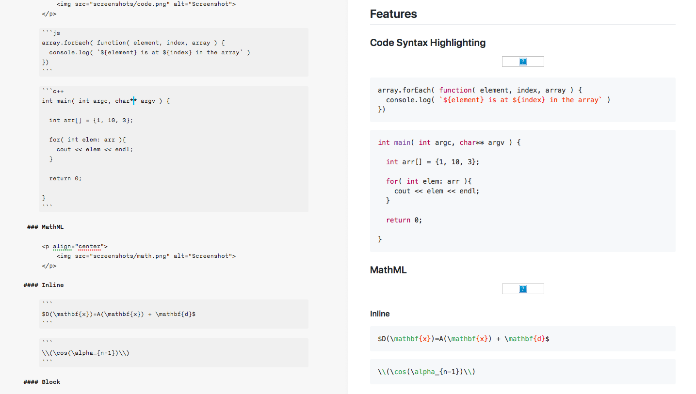

# GitHub-MathML

Custom iA Writer template with support for Math

## Installation

1. Download the latest `GitHub-MathML.zip` from the [Releases](https://github.com/jhermsmeier/github-math-iatemplate/releases)
2. Unzip and open the `.iatemplate` file
3. iA Writer should automatically open & install the template

Same thing for updates – iA Writer will prompt you if you want to replace the currently installed template with the new one.

## Features

### Code Syntax Highlighting in both light & night modes

<p align="center">
    
</p>

### MathML

<p align="center">
    
</p>

#### Inline

$D(\mathbf{x})=A(\mathbf{x}) + \mathbf{d}$

```tex
$D(\mathbf{x})=A(\mathbf{x}) + \mathbf{d}$
```

\\(\cos(\alpha_{n-1})\\)

```tex
\\(\cos(\alpha_{n-1})\\)
```

#### Block

$$D(\mathbf{x})=A(\mathbf{x}) + \mathbf{d}$$

```tex
$$D(\mathbf{x})=A(\mathbf{x}) + \mathbf{d}$$
```

\\[
[^{i-1}T_i] = \left( \begin{array}{r}
    \cos(θ_i) & -\sin(θ_i) \cos(⍺_{i,i+1}) & \sin(θ_i) \sin(⍺_{i,i+1}) & a_{i,i+1} \cos(θ_i) \\
    \sin(θ_i) & \cos(θ_i) \cos(⍺_{i,i+1}) & -\sin(θ_i) \sin(⍺_{i,i+1}) & a_{i,i+1} \sin(θ_i) \\
    0 & \sin(⍺_{i,i+1}) & \cos(⍺_{i,i+1}) & d_i \\
    0 & 0 & 0 & 1
\end{array} \right)
\\]

```tex
\\[
[^{i-1}T_i] = \left( \begin{array}{r}
    \cos(θ_i) & -\sin(θ_i) \cos(⍺_{i,i+1}) & \sin(θ_i) \sin(⍺_{i,i+1}) & a_{i,i+1} \cos(θ_i) \\
    \sin(θ_i) & \cos(θ_i) \cos(⍺_{i,i+1}) & -\sin(θ_i) \sin(⍺_{i,i+1}) & a_{i,i+1} \sin(θ_i) \\
    0 & \sin(⍺_{i,i+1}) & \cos(⍺_{i,i+1}) & d_i \\
    0 & 0 & 0 & 1
\end{array} \right)
\\]
```
